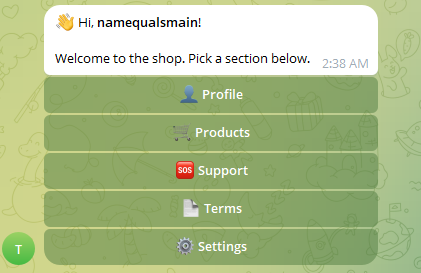
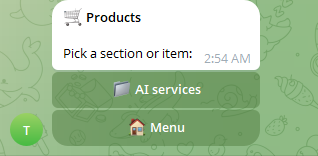
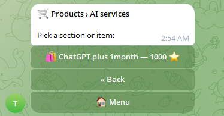
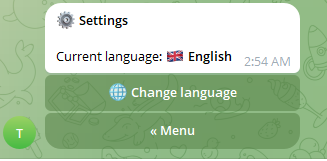

# 🛒 Telegram Marketplace Bot

[](https://github.com/namequalsmain-png/telegram-marketplace-bot/actions/workflows/ci.yml)
[](https://www.python.org/downloads/)
[](LICENSE)

A production-ready Telegram bot that powers a small online marketplace: browse
categories, view products, pay with Telegram Stars (⭐). Comes with a full admin
panel for managing the catalog, broadcasting messages, and moderating users.

Built as a portfolio project to demonstrate clean async Python architecture
with **aiogram 3**, **SQLAlchemy 2 (async)**, **PostgreSQL**, **Alembic**, and
**Docker**.

---

## ✨ Features

### For users
- 🌐 **Multi-language** — Russian and English out of the box, easy to add more
- 📁 **Unlimited category nesting** — admin decides the tree depth
- 🛍 **Product cards** with photos, descriptions, and Telegram Stars pricing
- 💳 **Native Telegram Stars payments** (XTR currency, no payment provider required)
- 🔔 **Optional force-subscribe** to a channel (toggled by admin without restart)
- 👤 **Profile** with balance and registration date

### For admins
- 📁 **Catalog CRUD** — add / rename / delete categories and products (with photo upload)
- 📣 **Broadcast** with rate-limit handling, blocked-user detection, and delivery report
- 📊 **Statistics** — users, admins, banned, products, purchases, revenue
- 👥 **User moderation** — ban / unban / promote / demote by Telegram ID
- ⚙️ **Runtime settings** — required channel, ToS text, support contact, edited via UI

---

## 🛠 Tech stack

| Layer | Tool |
|---|---|
| Bot framework | [aiogram 3.x](https://docs.aiogram.dev/) (async, type-hinted, router-based) |
| ORM | [SQLAlchemy 2.0](https://docs.sqlalchemy.org/) with async session |
| Database | PostgreSQL 16 via [asyncpg](https://magicstack.github.io/asyncpg/) |
| Migrations | [Alembic](https://alembic.sqlalchemy.org/) |
| Containerization | Docker + Docker Compose |
| Linting | [Ruff](https://docs.astral.sh/ruff/) |
| Tests | pytest + pytest-asyncio + aiosqlite (in-memory DB) |
| CI | GitHub Actions |

---

## 📂 Project layout

```
market/
├── config.py                  # Pydantic-style settings from .env
├── main.py                    # Entry point: wires middlewares + routers
├── alembic/                   # DB migrations
├── database/
│   ├── models.py              # SQLAlchemy models (5 tables)
│   ├── session.py             # Engine + init helpers
│   └── repo/                  # Repository layer — all SQL lives here
│       ├── users.py
│       ├── categories.py
│       ├── products.py
│       ├── purchases.py
│       └── settings.py
├── bot/
│   ├── loader.py              # Bot + Dispatcher singletons
│   ├── i18n.py                # Translations dict + t() helper
│   ├── callbacks.py           # Typed CallbackData factories
│   ├── utils.py               # send_or_edit helper
│   ├── filters/admin.py       # IsAdmin filter
│   ├── middlewares/
│   │   ├── db.py              # Inject AsyncSession into handlers
│   │   ├── user.py            # Fetch User, inject as `user`, block banned
│   │   └── subscription.py    # Force-subscribe gate
│   ├── user/                  # User-facing handlers
│   └── admin/                 # Admin-facing handlers
└── tests/                     # Pytest suite
```

**Architectural notes:**
- **Repository pattern** — handlers never touch raw SQL. Change schema → edit `repo/`, handlers stay.
- **Typed `CallbackData`** — no fragile `call.data.split(":")[2]`; renames are caught by IDE.
- **`send_or_edit` helper** — eliminates `if isinstance(target, Message) else ...` repetition.
- **i18n separated from logic** — handlers ask `t(user.language, "key", **vars)`; adding a language = one dict.
- **Settings in DB, not env** — admin can toggle force-subscribe, change ToS text, etc. without restart.

---

## 🚀 Quick start (Docker)

```bash
# 1. Clone
git clone https://github.com/namequalsmain-png/telegram-marketplace-bot.git
cd telegram-marketplace-bot

# 2. Configure
cp .env.example .env
# Edit .env: set BOT_TOKEN (from @BotFather) and MAIN_ADMIN_ID (from @userinfobot)

# 3. Run
docker compose up -d --build

# 4. Watch logs
docker compose logs -f bot
```

Open your bot in Telegram and send `/start`. As `MAIN_ADMIN_ID`, you'll see the `/admin` command available.

---

## 🧑‍💻 Local development (without Docker)

Requires Python 3.11+ and a running PostgreSQL.

```bash
# Install deps
python -m venv .venv
source .venv/bin/activate            # Windows: .venv\Scripts\activate
pip install -r requirements-dev.txt

# Configure
cp .env.example .env
# Edit .env

# Apply migrations
alembic upgrade head

# Run
python main.py
```

### Running tests

```bash
pytest
```

### Linting

```bash
ruff check .
ruff format .
```

---

## 🗄 Database migrations

This project uses Alembic. Anytime you change a model:

```bash
# Generate a new revision from model diffs
alembic revision --autogenerate -m "add foo column"

# Apply
alembic upgrade head

# Roll back one step
alembic downgrade -1
```

---

## 🌍 Adding a new language

1. Open [`bot/i18n.py`](bot/i18n.py).
2. Add the code to `LANGUAGES`:
   ```python
   LANGUAGES = {"ru": "🇷🇺 Русский", "en": "🇬🇧 English", "he": "🇮🇱 עברית"}
   ```
3. Add the same key to every entry in `TRANSLATIONS`. Missing keys fall back to `DEFAULT_LANG`.

No code changes needed — the language picker and settings menu pick up the new option automatically.

---

## 📸 Screenshots

<table>
  <tr>
    <td align="center">
      <br/>
      <sub><b>Main menu</b> — inline-only buttons, localized</sub>
    </td>
    <td align="center">
      <br/>
      <sub><b>Catalog</b> — nested categories with breadcrumbs</sub>
    </td>
  </tr>
  <tr>
    <td align="center">
      <br/>
      <sub><b>Products</b> — name + price in ⭐ Telegram Stars</sub>
    </td>
    <td align="center">
      <br/>
      <sub><b>Settings</b> — switch UI language at any time</sub>
    </td>
  </tr>
</table>

---

## 📜 License

MIT — see [LICENSE](LICENSE).
